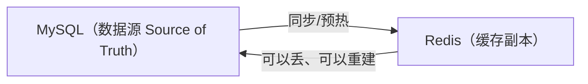

# Docker 知识清单（面试可用版）

> 定于 2026-09-25（秒杀项目 Docker 化当天）
> 原则：**只写"能讲 + 能答"的**；标 ⭐ 的是高频必问
> 用法：考前翻一遍，每个点能用自己的话讲 30 秒

---

## 〇、我的项目实战（先讲这个，最加分）

**我做了什么**：
| 产物 | 内容 |
|---|---|
| `docker-compose.yml` | 编排 **MySQL(3307) + Redis(6380) + RabbitMQ(5672/15672)** |
| `Dockerfile` | 把秒杀应用打成镜像（`eclipse-temurin:21-jre` 基础镜像） |
| `application-docker.yml` | Docker 环境专用配置（用 `host.docker.internal`） |

**关键技术点**（面试可讲）：
1. **一键启动环境**：`docker compose up -d` 起 3 个中间件
2. **数据持久化**：`volumes`（容器删了数据还在）
3. **自动初始化**：`./sql:/docker-entrypoint-initdb.d`（首次启动自动建表）
4. **健康检查**：MySQL `healthcheck`（就绪后才标记 healthy）
5. **端口映射**：`3307:3306`（宿主机:容器，避开本机已占用的 3306）
6. **应用镜像**：`Dockerfile` + `eclipse-temurin:21-jre` 基础镜像
7. **配置分离**：`application-docker.yml` + `--spring.profiles.active=docker`
8. **踩过的坑**：容器里连宿主机**不能用 `localhost`**，要用 **`host.docker.internal`**
9. **⭐ 库存预热**：应用启动时用 `CommandLineRunner` 把 DB 库存写入 Redis（见第五章）
10. **踩过的坑 2**：Docker Hub 拉镜像慢 → 配 `registry-mirrors` 加速器

**一句话总结**：
> "用 Docker Compose 编排中间件，应用打成镜像，**保证开发/测试/生产环境一致**，一条命令起环境。"

---

## 一、⭐ 核心概念（必问）

### 1. Docker 是什么？
- **容器化平台**：把应用 + 依赖 + 环境**打包成一个镜像**，在任何装了 Docker 的机器上**一致运行**
- **解决的问题**：**"在我机器上能跑，在你机器上跑不起来"**（环境不一致）

### 2. ⭐⭐ 容器 vs 虚拟机（**最高频**）

| 维度 | 虚拟机（VM） | 容器（Docker） |
|---|---|---|
| **虚拟化层级** | **硬件级**（Hypervisor 虚拟出硬件） | **操作系统级**（共享宿主内核） |
| **是否含 OS** | **每个 VM 有完整 Guest OS** | **不含 OS，共享宿主内核** |
| **启动速度** | 分钟级 | **秒级**（甚至毫秒） |
| **体积** | GB 级 | **MB 级** |
| **隔离性** | 强（完全隔离） | 弱（共享内核，隔离靠 namespace） |
| **性能** | 有虚拟化开销 | **接近原生** |

**一句话**：**VM 虚拟"硬件"，容器虚拟"操作系统"（共享内核）。所以容器更轻、更快。**

### 3. ⭐ 镜像 vs 容器

| | 镜像（Image） | 容器（Container） |
|---|---|---|
| 类比 | **类（class）** | **实例（instance）** |
| 关系 | 只读模板 | 镜像的运行实例 |
| 数量 | 一个镜像 → **多个容器** | 每个容器有可写层 |
| 命令 | `docker images` | `docker ps` |

**一句话**：**镜像是"只读模板"，容器是"运行中的实例"，容器 = 镜像 + 可写层。**

---

## 二、⭐ 常用命令（按场景记）

### 镜像
```bash
docker images                    # 列出镜像
docker build -t 名字:版本 .       # 构建镜像（. = 当前目录找 Dockerfile）
docker rmi 镜像ID                 # 删镜像
docker pull mysql:8.0            # 拉镜像
```

### 容器
```bash
docker run -d --name 名字 -p 8081:8081 镜像名   # 后台运行 + 命名 + 端口映射
docker ps                        # 运行中的容器（-a 看全部）
docker stop/start/restart 名字    # 停止/启动/重启
docker rm -f 名字                # 强制删除
docker exec -it 名字 bash        # 进入容器（-it 交互式终端）
docker logs -f 名字              # 看日志（-f 实时跟踪）
```

### Compose
```bash
docker compose up -d             # 启动全部（-d 后台）
docker compose ps                # 查看状态
docker compose logs -f           # 看日志
docker compose stop              # 停止（不删容器）
docker compose down              # 停止 + 删容器（保留卷）
docker compose down -v           # ⚠️ 连数据卷也删（数据全没！）
```

**关键记忆**：
- **`-d`** = detach（后台）
- **`-p 宿主:容器`** = 端口映射（**前面是宿主机**）
- **`-v 宿主:容器`** = 挂载卷
- **`-e KEY=VALUE`** = 环境变量

---

## 三、⭐ Dockerfile 指令

| 指令 | 作用 | 示例 |
|---|---|---|
| **FROM** | **基础镜像**（必须是第一条） | `FROM eclipse-temurin:21-jre` |
| **WORKDIR** | 设置工作目录 | `WORKDIR /app` |
| **COPY** | 复制文件进镜像 | `COPY target/app.jar app.jar` |
| **ADD** | 类似 COPY（还能解压 tar、支持 URL） | 优先用 COPY |
| **RUN** | **构建时**执行命令 | `RUN apt-get install -y curl` |
| **EXPOSE** | **声明**端口（文档作用，不真映射） | `EXPOSE 8081` |
| **ENV** | 设置环境变量 | `ENV JAVA_OPTS="-Xmx512m"` |
| **ENTRYPOINT** | **启动命令**（不易被覆盖） | `ENTRYPOINT ["java","-jar","app.jar"]` |
| **CMD** | 默认命令（**可被 `docker run` 参数覆盖**） | `CMD ["--help"]` |
| **VOLUME** | 声明数据卷 | `VOLUME /data` |

### ⭐ ENTRYPOINT vs CMD（易混）

| | ENTRYPOINT | CMD |
|---|---|---|
| 作用 | **固定入口**（容器就是干这个的） | **默认参数**（可被覆盖） |
| 覆盖 | `docker run --entrypoint xxx` 才能覆盖 | `docker run 镜像 新命令` 直接覆盖 |
| 常搭配 | **ENTRYPOINT 定命令 + CMD 定默认参数** | |

**示例**：
```dockerfile
ENTRYPOINT ["java", "-jar", "app.jar"]
CMD ["--spring.profiles.active=prod"]     # 可被 docker run 覆盖
```

### ⭐ COPY vs ADD
- **COPY**：只复制文件（**推荐**）
- **ADD**：额外支持**自动解压 tar** + **URL 下载**（**不推荐**，行为不透明）

---

## 四、⭐ 数据卷（Volume）

### 为什么需要？
**容器一删，里面的数据就没了**。数据库必须有持久化。

### 三种挂载方式

| 方式 | 写法 | 说明 |
|---|---|---|
| **命名卷**（推荐） | `mysql-data:/var/lib/mysql` | Docker 管理，位置在 `/var/lib/docker/volumes/` |
| **绑定挂载** | `./sql:/docker-entrypoint-initdb.d` | 挂宿主机目录（开发常用） |
| **匿名卷** | `/var/lib/mysql` | 不推荐（难管理） |

### 我的项目用法
```yaml
volumes:
  - mysql-data:/var/lib/mysql              # 命名卷：数据持久化
  - ./sql:/docker-entrypoint-initdb.d      # 绑定挂载：初始化脚本
```

**关键**：
- **`docker compose down`** → **不删卷**（数据还在）✅
- **`docker compose down -v`** → **删卷**（数据全没）⚠️

---

## 五、⭐⭐ 启动初始化：库存预热（我的实战）

### 问题背景（为什么要这个）

**我遇到的真实 bug**：
```
容器 Redis 是全新的空库 → 没有 seckill:stock:1 这个 key
→ STOCK_LUA 返回 -1 → 接口报"商品不存在"
```

**根因**：**秒杀依赖 Redis 里预存的库存，但没有任何代码负责"创建"它。**
> 之前是手动 `SET` 的 → **Redis 一重启，秒杀直接失效。**

### 核心认知：DB 是数据源，Redis 是副本



**原则**：
> **Redis 里的数据永远从 DB 来。Redis 可以丢，但必须能"从 DB 重建"。**

### 解法：`CommandLineRunner` 启动预热

```java
@Component
public class StockPreheatRunner implements CommandLineRunner {

    private final SeckillGoodsMapper goodsMapper;
    private final StringRedisTemplate redisTemplate;

    public StockPreheatRunner(SeckillGoodsMapper goodsMapper,
                              StringRedisTemplate redisTemplate) {
        this.goodsMapper = goodsMapper;
        this.redisTemplate = redisTemplate;
    }

    @Override
    public void run(String... args) {
        List<SeckillGoods> goodsList = goodsMapper.selectAll();
        for (SeckillGoods goods : goodsList) {
            String key = "seckill:stock:" + goods.getId();
            String value = String.valueOf(goods.getStock());
            redisTemplate.opsForValue().set(key, value);
        }
    }
}
```

### `CommandLineRunner` 是什么

**Spring Boot 提供的接口：应用【启动完成后】自动调用 `run()`。**

**执行时机**（重要）：
```
Spring 启动
  → 创建所有 Bean（Mapper、RedisTemplate 已注入完毕）★
  → 启动 Tomcat
  → ★ 调用 CommandLineRunner.run()
  → 应用就绪
```

**为什么不用 `@PostConstruct`**：
| | `@PostConstruct` | `CommandLineRunner` |
|---|---|---|
| 执行时机 | **当前 Bean 初始化后** | **所有 Bean 就绪 + Web 启动后** |
| 风险 | 其他 Bean 可能未就绪 | ✅ 安全 |

### `StringRedisTemplate` 操作类型

```java
redisTemplate.opsForValue().set(key, value);   // String
//           ↑ "操作字符串"   ↑ 相当于 SET 命令
```

| 方法 | Redis 类型 |
|---|---|
| `opsForValue()` | **String**（SET/GET/INCR） |
| `opsForHash()` | Hash（HSET/HGET）← 令牌桶用这个 |
| `opsForList()` | List |
| `opsForSet()` | Set |
| `opsForZSet()` | ZSet |

### ⚠️ 预热的副作用（要知道）

**预热会"覆盖" Redis 现有值，以 DB 为准。**

```
场景：Redis = 95（扣过），DB = 98（没扣）
   ↓ 应用重启预热
Redis → 98    ← 不一致被"抹平"（以 DB 为准）
```

**这是"DB 为数据源"的正确行为**，但**要知道**：
> **预热能自动修复"Redis 与 DB 不一致"** —— 前提是 **DB 是准的**。

### 面试可讲

> **Q：Redis 里的库存怎么来的？Redis 挂了重启怎么办？**
>
> A：秒杀依赖 Redis 预存的库存。但 Redis 是缓存、会丢，所以我在应用启动时用 **`CommandLineRunner` 做库存预热**——从 **MySQL**（数据源）读商品库存，写入 Redis。
> 这样 **Redis 重启后，应用一启动就自动恢复**，不需要人工干预。
> 而且**以 DB 为准**，能顺手修复不一致。
> 我还**实测验证**过：清空 Redis 的 key → 重启容器 → 日志出现"库存预热" → 接口恢复正常。

---

## 六、⭐ 网络与端口

### 端口映射原理
```
宿主 3307  →  容器 3306
-p 3307:3306
     ↑ 宿主机端口（外部访问）
        ↑ 容器内端口
```

**注意**：**容器内的应用还是认为自己跑在 3306**（内部不变）。

### ⭐⭐ 容器互访 / 连宿主机（**踩过的坑**）

| 场景 | 用什么地址 |
|---|---|
| **容器 A 连容器 B**（同一 compose 网络） | **服务名**（如 `mysql:3306`） |
| **容器连宿主机** | **`host.docker.internal`** ⚠️ **不能用 localhost！** |
| 宿主机连容器 | `localhost:映射端口` |

**为什么不能 localhost**：
> **容器里的 `localhost` = 容器自己**，不是宿主机。
> 应用在容器里跑，MySQL 在宿主机 → 必须用 `host.docker.internal`。

**我的项目**：
```yaml
# application-docker.yml
url: jdbc:mysql://host.docker.internal:3307/seckill
host: host.docker.internal      # redis / rabbitmq 同理
```

### 网络模式（了解）

| 模式 | 说明 |
|---|---|
| **bridge**（默认） | 容器有独立 IP，通过端口映射对外 |
| **host** | 容器直接用宿主网络（无隔离） |
| **none** | 无网络 |
| **container:xxx** | 共用另一个容器的网络 |

---

## 七、⭐ Docker Compose

### 解决什么问题？
**多个容器要一起管理**（MySQL + Redis + RabbitMQ + 应用）。

**没有 Compose**：手敲 4 条 `docker run`，参数记不住，顺序要管。
**有 Compose**：**一个 yml 文件 + 一条命令**。

### 核心结构
```yaml
services:              # 定义各个容器
  mysql:               # 服务名（也是容器间互访的域名）
    image: mysql:8.0
    container_name: seckill-mysql
    ports:
      - "3307:3306"
    environment:
      - MYSQL_ROOT_PASSWORD=123456
    volumes:
      - mysql-data:/var/lib/mysql
    healthcheck:                              # 健康检查
      test: ["CMD", "mysqladmin", "ping", "-h", "localhost", "-p123456"]
      interval: 10s
      timeout: 5s
      retries: 5

volumes:               # 声明命名卷
  mysql-data:
```

### 关键点
1. **服务名 = 容器间互访的域名**（`mysql:3306`）
2. **`depends_on`**：控制启动顺序（但**不等健康**，要配 `condition: service_healthy`）
3. **`healthcheck`**：定义"怎么算健康"（我用来确保 MySQL 就绪）
4. **`.env` 文件**：可放环境变量，避免硬编码密码

---

## 八、⭐ 镜像分层（进阶，了解）

### 原理
**Dockerfile 的每条指令 = 一层**，层**只读 + 可复用**。

```dockerfile
FROM eclipse-temurin:21-jre    # 第1层
WORKDIR /app                    # 第2层
COPY app.jar app.jar            # 第3层
ENTRYPOINT [...]                # 第4层
```

**好处**：
- **层可缓存**：改第 4 层，前 3 层用缓存 → **构建快**
- **层可共享**：多个镜像共用基础层 → **省磁盘**

**优化技巧**：**把"不常变的"放前面**（如 `COPY pom.xml` 后先 `mvn dependency:go-offline`），**"常变的"放后面**。

### 多阶段构建（镜像瘦身）
```dockerfile
# 阶段1：编译（用 JDK）
FROM maven:3.9-eclipse-temurin-21 AS builder
WORKDIR /build
COPY . .
RUN mvn clean package -DskipTests

# 阶段2：运行（只留 JRE + jar）
FROM eclipse-temurin:21-jre
WORKDIR /app
COPY --from=builder /build/target/*.jar app.jar
ENTRYPOINT ["java","-jar","app.jar"]
```
**好处**：**最终镜像不含 Maven/JDK/源码**，体积小很多（529MB → ~200MB）。

**我的项目**：目前是**宿主机编译 + 单阶段**（简单）；**优化方向**是多阶段构建。

---

## 九、易混点速查

| 易混 | 区分 |
|---|---|
| **镜像 vs 容器** | 类 vs 实例 |
| **COPY vs ADD** | COPY 只复制；ADD 还能解压/下载 |
| **ENTRYPOINT vs CMD** | 固定入口 vs 可覆盖默认参数 |
| **RUN vs CMD** | **构建时**执行 vs **运行时**执行 |
| **EXPOSE vs -p** | 声明（文档） vs 真映射 |
| **容器 localhost vs host.docker.internal** | 容器自己 vs 宿主机 |
| **`down` vs `down -v`** | 保留数据 vs **删数据** |
| **容器 vs 虚拟机** | 共享内核（轻） vs 完整 OS（重） |

---

## 十、面试问答题（背这 10 个）

1. **Docker 是什么？解决什么问题？**
   → 容器化平台；解决"环境不一致"（在我机器上能跑）。

2. **⭐ 容器和虚拟机的区别？**
   → VM 虚拟硬件、含完整 OS、GB 级、分钟级启动；容器**共享宿主内核**、MB 级、秒级启动、接近原生性能。

3. **⭐ 镜像和容器的关系？**
   → 镜像 = 只读模板（类）；容器 = 运行实例（对象）；容器 = 镜像 + 可写层。

4. **Dockerfile 常用指令？**
   → FROM / WORKDIR / COPY / RUN / EXPOSE / ENTRYPOINT / CMD。

5. **ENTRYPOINT 和 CMD 的区别？**
   → ENTRYPOINT 是固定入口（难覆盖）；CMD 是默认参数（`docker run` 时易覆盖）。常搭配使用。

6. **⭐ 数据卷是干什么的？**
   → 持久化数据。容器删了数据还在。我用命名卷存 MySQL 数据。

7. **⭐ 容器里怎么连宿主机的数据库？**
   → **不能用 localhost**（那是容器自己），要用 **`host.docker.internal`**。我踩过这个坑。

8. **Docker Compose 解决什么问题？**
   → 多容器编排。一个 yml + 一条 `docker compose up -d` 起全部；服务名做互访域名；可配 healthcheck 控顺序。

9. **⭐ 应用启动时怎么做初始化？**（我的实战）
   → 用 **`CommandLineRunner`**：应用启动完成后自动调用 `run()`，此时所有 Bean 已注入完毕，可以安全做"预热缓存"。
   → 我用它把 **DB 库存预热到 Redis**，解决"Redis 重启后 key 丢失导致秒杀失效"。

10. **镜像拉取很慢怎么办？**
   → 配 **`registry-mirrors`**（国内加速器，如 `docker.1ms.run`）；或指定加速域名拉取。我踩过从 Docker Hub 拉 `eclipse-temurin` 卡住的坑。

---

## 十一、我的项目可讲的"Docker 故事"（30 秒）

> "秒杀项目有三个中间件依赖（MySQL、Redis、RabbitMQ）。为了**环境一致**和**一键启动**，我用 **Docker Compose** 把它们编排起来——自定义端口避开本机冲突，用 **volumes** 做数据持久化，用 **`docker-entrypoint-initdb.d`** 挂载初始化 SQL 自动建表，还给 MySQL 配了 **healthcheck**。
> 应用本身写 **Dockerfile** 打成镜像，基础镜像是 `eclipse-temurin:21-jre`，用 **profile** 切换容器内配置。
> **踩过两个坑**：
> ① 容器里连宿主机的 MySQL 不能用 `localhost`，要用 `host.docker.internal`，所以单独写了 `application-docker.yml`；
> ② Redis 是空库导致秒杀失效，所以我用 **`CommandLineRunner` 做了库存预热**——启动时从 DB 把库存写入 Redis，Redis 重启也能自动恢复。"

**这段讲完，Docker 这块就够了。**

---

## 十二、待补 / 可选（不必现在做）
- [ ] 多阶段构建（镜像瘦身）
- [ ] 推镜像到 Docker Hub / 阿里云
- [ ] CI/CD 集成（GitHub Actions 自动构建）
- [ ] Kubernetes（K8s）基础（比 Docker Compose 更强大的编排）
