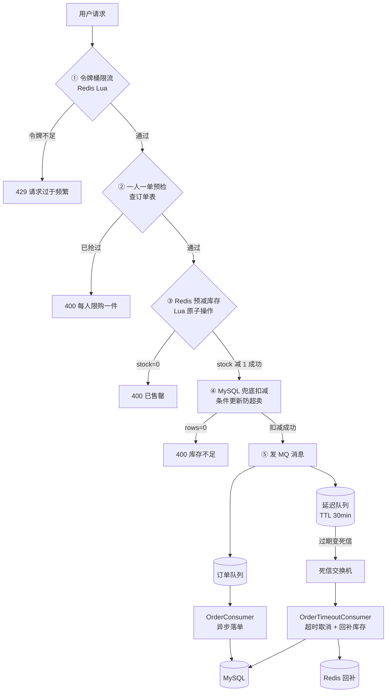

# 秒杀系统（Seckill）

> 一个从零手写的**高并发电商秒杀系统**，聚焦「防超卖、削峰限流、消息可靠性」三大核心难点。
> Spring Boot 3.4 + Java 21 + Redis + RabbitMQ + MySQL + Docker

---

## 📖 项目简介

秒杀场景的本质是：**瞬时高并发流量**冲击一个**库存有限的商品**。

如果不做任何处理，会出现三类经典问题：

| 问题 | 后果 |
|---|---|
| **超卖** | 库存 100 件，卖出 120 单 → 商家亏钱 |
| **系统被打爆** | 数据库连接耗尽、服务雪崩 |
| **订单丢失** | 用户付款了但系统没订单 → 客诉 |

本项目逐层解决这三个问题，共实现 **8 个核心功能**，并在本地做过多轮**并发压测验证**。

---

## 🏗️ 整体架构



---

## ✨ 核心功能（8 项）

### 1. 防超卖 —— 双层防线

**问题**：`SELECT stock → 判断 >0 → UPDATE stock-1` 是典型的 **check-then-act**。
两个并发请求都读到 `stock=1`，都通过判断，都执行 UPDATE → **库存变成 -1**。

**解决**：

```java
// 第一层：Redis + Lua 原子预减（挡住 99% 流量，不碰数据库）
private static final String STOCK_LUA =
    "local stock = tonumber(redis.call('GET', KEYS[1])) " +
    "if stock == nil then return -1 end " +          // 商品不存在
    "if stock < tonumber(ARGV[1]) then return 0 end " + // 库存不足
    "redis.call('DECRBY', KEYS[1], ARGV[1]) " +      // 原子扣减
    "return 1";
```

```java
// 第二层：MySQL 条件更新兜底（行锁保证原子）
@Update("UPDATE seckill_goods SET stock = stock - 1, version = version + 1 " +
        "WHERE id = #{id} AND stock > 0")   // ← 关键：AND stock > 0
int deductStock(@Param("id") Long id);
```

> **为什么"一条 UPDATE"能防超卖？**
> MySQL 会对该行加**写锁**。并发的第二条 UPDATE 会**阻塞等待**，
> 等第一条提交后再执行 —— 此时 `stock` 已为 0，`WHERE` 不匹配，返回 0 行。
> 这叫**悲观锁 / 原子条件更新**（不是乐观锁，乐观锁需要 `version = #{version}` 判断）。

---

### 2. 一人一单

**三层保障**：

| 层 | 手段 | 作用 |
|---|---|---|
| 业务层 | `selectByUserAndGoods` 预检 | 挡住重复请求，省资源 |
| 数据库 | `UNIQUE KEY uk_user_goods (user_id, goods_id)` | **并发下的最终兜底** |
| 异常层 | `GlobalExceptionHandler` 捕获 `DuplicateKeyException` | 友好返回 |

---

### 3. 令牌桶限流

```java
private static final String TOKEN_BUCKET_LUA =
    "local capacity = tonumber(ARGV[1]) " +      // 桶容量
    "local rate = tonumber(ARGV[2]) " +          // 每秒补充速率
    "local time = redis.call('TIME') " +
    "local now = tonumber(time[1]) " +
    "local bucket = redis.call('HMGET', key, 'tokens', 'last_refill') " +
    // ... 按经过时间补充令牌，够 1 个就放行
```

**参数**：容量 10、速率 5/秒。Lua 保证「读令牌 → 判断 → 扣令牌」原子。

---

### 4. MQ 异步削峰

**下单时不再同步写数据库**，而是发一条消息，由消费者异步落单。

```java
rabbitTemplate.convertAndSend(
        "",                                  // 默认交换机
        RabbitMQConfig.SECKILL_ORDER_QUEUE,  // routingKey = 队列名
        userId + ":" + goodsId + ":" + orderNo,
        new CorrelationData(orderNo + ":order"));  // 消息身份证
```

> ⚠️ **踩坑记录**：加 `CorrelationData` 时必须用 **4 参版**（显式写交换机+routingKey），
> 不能用 `convertAndSend(队列名, 消息)` 这种 2 参简化写法 —— 会**重载歧义**。

**效果**：接口响应从「等数据库写」变成「发个消息就返回」，RT 大幅下降。

---

### 5. MQ 可靠性 —— 三层保障

| 层 | 机制 | 防止 |
|---|---|---|
| **生产者 → Broker** | `publisher-confirm-type: correlated` + `MqConfirmCallback` | 消息没到 Broker |
| **Broker 存储** | 队列 `durable=true` + 消息持久化 | Broker 重启丢消息 |
| **消费者 → 业务** | 重试 3 次（指数退避）→ 死信队列 | 消费失败静默丢失 |

```java
@Component
public class MqConfirmCallback implements RabbitTemplate.ConfirmCallback {
    @Override
    public void confirm(CorrelationData correlationData, boolean ack, String cause) {
        String id = correlationData != null ? correlationData.getId() : "无ID";
        if (ack) System.out.println("【confirm】broker 已收到，id=" + id);
        else     System.out.println("【confirm】❌ broker 未收到！id=" + id + "，原因=" + cause);
    }
}
```

---

### 6. 订单超时自动取消（延迟队列）

**方案**：TTL + 死信队列（**没有引入额外插件**）

```java
@Bean
public Queue seckillOrderDelayQueue() {
    Map<String, Object> args = new HashMap<>();
    args.put("x-message-ttl", ORDER_TIMEOUT_MS);                        // 30 分钟
    args.put("x-dead-letter-exchange", RabbitMQConfig.SECKILL_DLX);     // 过期去死信交换机
    args.put("x-dead-letter-routing-key", SECKILL_ORDER_TIMEOUT_ROUTING_KEY);
    return new Queue(SECKILL_ORDER_DELAY_QUEUE, true, false, false, args);
}
```

**流程**：

```
下单 → 发延迟消息 → 延迟队列（无消费者，躺 30 分钟）
  → 过期变死信 → seckill.dlx → 超时处理队列
  → OrderTimeoutConsumer：查订单 → status=0 才取消 + 回补库存
```

**为什么必须再查一次订单状态？**
消息是 30 分钟前发的，这期间**用户可能已经付款了**！
所以消费者要先查当前状态：

| 状态 | 处理 |
|---|---|
| `0` 待支付 | ✅ 取消订单 + 回补库存 |
| `1` 已支付 | ⏭️ **跳过**（绝不能取消！） |
| `2` 已取消 | ⏭️ **跳过**（幂等，消息重复投递） |

---

### 7. 库存预热

应用启动时，把数据库库存一次性加载到 Redis。

```java
@Component
public class StockPreheatRunner implements CommandLineRunner {
    @Override
    public void run(String... args) {
        List<SeckillGoods> goodsList = goodsMapper.selectAll();
        for (SeckillGoods goods : goodsList) {
            redisTemplate.opsForValue().set(
                "seckill:stock:" + goods.getId(),
                String.valueOf(goods.getStock()));
        }
    }
}
```

**为什么需要？** 否则第一个请求来的时候 Redis 里没这个 key，Lua 直接返回 `-1`（商品不存在）。

> 💡 **设计说明**：每次启动**无条件覆盖** Redis 值。
> 因为扣减是 Redis + DB **双写**的，两边本应一致；
> 覆盖相当于一次**对账**，能自动修复不一致。

---

### 8. Docker 容器化

```yaml
# docker-compose.yml
services:
  mysql:     # 端口 3307:3306
  redis:     # 端口 6380:6379
  rabbitmq:  # 端口 5672 / 15672
```

**Dockerfile**：

```dockerfile
FROM eclipse-temurin:21-jre
COPY target/seckill-0.0.1-SNAPSHOT.jar app.jar
EXPOSE 8081
ENTRYPOINT ["java","-jar","app.jar","--spring.profiles.active=docker"]
```

**配置文件隔离**：

| 文件 | 数据库地址 | Redis 地址 | 场景 |
|---|---|---|---|
| `application.yml` | `localhost:3307` | `localhost:6379` | 本机开发 |
| `application-docker.yml` | `host.docker.internal:3307` | `host.docker.internal:6379` | 容器内运行 |

> ⚠️ **容器内不能用 `localhost`**！容器里的 localhost 是容器自己，
> 要用 `host.docker.internal` 指向宿主机。

---

## 🐛 关键 Bug 修复记录

### 取消/超时订单未回补 Redis → 少卖

**现象**：商品 `stock=1`，用户抢到后未支付，30 分钟后自动取消。
DB 库存回到 1，但 **Redis 库存仍是 0** → 后续所有请求在 Lua 第一步就被拦下 → **商品再也卖不出去**。

**根因**：只回补了 DB，漏了 Redis。

**修复**：新增 `ADD_STOCK_LUA`，在取消路径同步回补：

```java
private static final String ADD_STOCK_LUA =
    "if redis.call('EXISTS', KEYS[1]) == 0 then return -1 end " +  // ★ 关键判断
    "return redis.call('INCR', KEYS[1])";
```

> **为什么要 `EXISTS` 判断？**
> 如果 key 已过期或从未预热（比如新加的商品），无脑 `INCR` 会**凭空造出库存**。
> 判断存在才回补，保证只修补真实预减过的商品。

---

## 📡 接口清单

| 接口 | 方法 | 参数 | 说明 |
|---|---|---|---|
| `/api/seckill/redis` | POST | `userId`, `goodsId` | **秒杀主接口**（Redis + MQ） |
| `/api/seckill/do` | POST | `userId`, `goodsId` | 秒杀（DB 兜底版，教学对比用） |
| `/api/seckill/pay` | POST | `orderNo` | 支付订单 |
| `/api/seckill/mq/test` | POST | `msg` | MQ 连通性测试 |

**订单状态机**：`0 待支付` → `1 已支付` / `2 已取消`

---

## 🚀 快速开始

### 前置要求

- JDK 21
- Maven 3.8+
- Docker Desktop

### 步骤

```bash
# 1. 启动依赖容器（MySQL / Redis / RabbitMQ）
docker compose up -d

# 2. 编译打包
mvn clean package -DskipTests

# 3. 启动应用（本机模式，连 3307/6379）
mvn spring-boot:run
```

访问 `http://localhost:8081/api/seckill/redis?userId=1&goodsId=1` 测试。

**RabbitMQ 管理台**：http://localhost:15672 （guest / guest）

### 容器化运行

```bash
mvn clean package -DskipTests
docker compose up -d
docker build -t seckill-app .
docker run --name seckill-app -p 8081:8081 \
  --add-host=host.docker.internal:host-gateway \
  seckill-app
```

---

## 📁 项目结构

```
seckill/
├── src/main/java/com/example/seckill/
│   ├── SeckillApplication.java      # 启动类
│   ├── controller/
│   │   └── SeckillController.java   # REST 接口
│   ├── service/
│   │   └── SeckillService.java      # 核心业务 + Lua 脚本
│   ├── mapper/
│   │   ├── SeckillGoodsMapper.java  # 商品（含防超卖条件更新）
│   │   └── SeckillOrderMapper.java  # 订单
│   ├── entity/
│   │   ├── SeckillGoods.java
│   │   └── SeckillOrder.java
│   ├── config/
│   │   ├── RabbitMQConfig.java          # 订单削峰 + 失败死信
│   │   ├── OrderTimeoutMQConfig.java    # 超时取消延迟队列
│   │   └── MqConfirmCallback.java       # 生产者确认回调
│   ├── consumer/
│   │   ├── OrderConsumer.java           # 异步落单
│   │   └── OrderTimeoutConsumer.java    # 超时取消 + 回补
│   ├── runner/
│   │   └── StockPreheatRunner.java      # 库存预热
│   └── common/
│       ├── Result.java                  # 统一响应
│       └── GlobalExceptionHandler.java  # 全局异常
├── src/main/resources/
│   ├── application.yml                  # 本机配置
│   └── application-docker.yml           # 容器配置
├── sql/init.sql                         # 建表 + 初始数据
├── Dockerfile
├── docker-compose.yml
└── test_concurrent.py                   # 并发压测脚本
```

---

## 🗄️ 数据库设计

```sql
CREATE TABLE seckill_goods (
    id          BIGINT PRIMARY KEY AUTO_INCREMENT,
    goods_name  VARCHAR(100),
    stock       INT NOT NULL,          -- 库存
    version     INT DEFAULT 0,         -- 版本号
    start_time  DATETIME,              -- 秒杀开始时间
    end_time    DATETIME,              -- 秒杀结束时间
    KEY idx_seckill_time (start_time, end_time)
);

CREATE TABLE seckill_order (
    id        BIGINT PRIMARY KEY AUTO_INCREMENT,
    order_no  VARCHAR(64) NOT NULL,
    user_id   BIGINT NOT NULL,
    goods_id  BIGINT NOT NULL,
    status    TINYINT DEFAULT 0,       -- 0待支付 1已支付 2已取消
    UNIQUE KEY uk_user_goods (user_id, goods_id),  -- ★ 一人一单兜底
    UNIQUE KEY uk_order_no (order_no)              -- ★ 幂等兜底
);
```

---

## 📊 技术栈

| 技术 | 版本 | 用途 |
|---|---|---|
| Spring Boot | 3.4.0 | 基础框架 |
| Java | 21 | LTS |
| MyBatis | 3.0.3 | ORM |
| MySQL | 8.0 | 持久化 |
| Redis | 7.x | 缓存 + Lua 原子操作 |
| RabbitMQ | 3.x | 异步削峰 + 延迟队列 |
| Docker | 29.x | 容器化 |
| Lombok | 1.18.46 | 简化代码 |

---

## 📝 并发测试

`test_concurrent.py` 用多线程模拟高并发抢购，验证：

- ✅ 库存不为负（无超卖）
- ✅ 订单数 ≤ 库存数
- ✅ 同一用户不产生多单

```bash
python test_concurrent.py
```

---

## 📄 License

MIT
