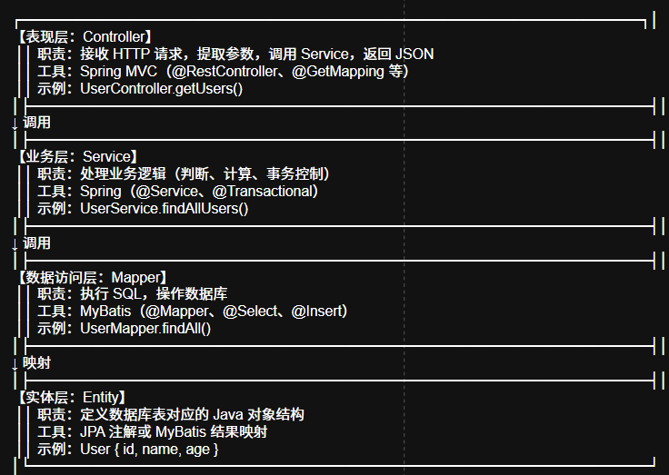
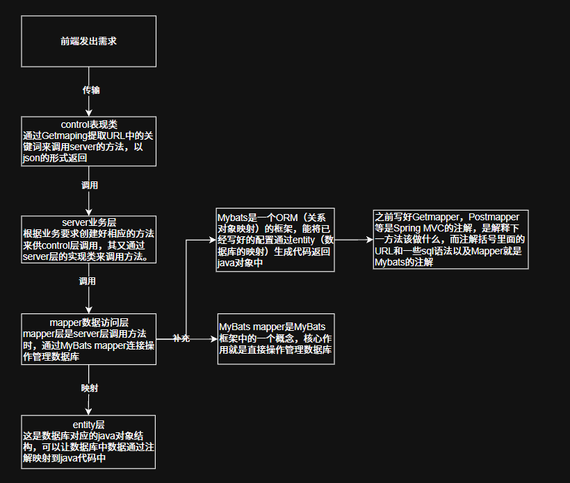

## 类解析
这个类的作用是：将其他插件或者是框架与spring-boot连接起来 比如：spring + javafx，让其共享同一个bean（对象）

## 包引入
````
import org.springframework.beans.BeansException;
import org.springframework.context.ApplicationContext;
import org.springframework.context.ApplicationContextAware;
import org.springframework.stereotype.Component;
````
这些是spring 与 javafx的包与方法，也相当于导入接口

## 相关知识解释
````
@Component ：这是注解，是spring的一个包，作用是向 Spring IoC 容器声明，启动spring时自动创建，需要spring自动管理。

@Override ：是java语法，声明这是一个重构或者父亲类

@Autowired 是 Spring 的依赖注入注解，用于将 Spring 容器中已经创建好的 Bean（对象）自动赋值给当前类的属性。

@Repository 就是像spring声明这是项目中的mapper，是数据访问层。

ApplicationContextAware ：这是一个感应spring的接口，向后续getbean传递信息。

ApplicationContext ：这是spring中的顶层接口，负责管理bean。

setApplicationContext ：这是一个接受和保存spring的一个方法，将方法存在端口中，通常只执行一次

getBean：是一个将bean从spring中取出的方法，他能被其他类随时调用。
````

## 流程图
````
     Spring 启动
        ⬇
创建 ApplicationContext 容器（此时容器已包含所有 bean 的定义）
        ⬇
Spring 扫描到 @Component，创建 SpringContextHolder 实例
        ⬇
发现该类实现了 ApplicationContextAware 接口
        ⬇
Spring 自动回调 setApplicationContext(ApplicationContext)，
将容器引用注入并保存到静态变量 context 中（只执行一次）
        ⬇
Spring 继续初始化其他 bean，完成启动
        ⬇
当其他插件（如 JavaFX）需要获取 bean 时，
调用 SpringContextHolder.getBean(Class) 静态方法
        ⬇
getBean 从已保存的 context 中取出对应的 bean 返回给调用方

  ````

  ## 框架数据流程图




