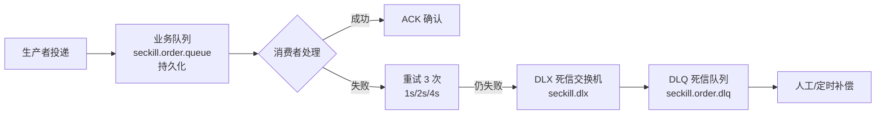

# MQ 消息队列知识总结

## 一、MQ 是什么？为什么用？

MQ（Message Queue，消息队列）是一种**异步通信**的中间件。生产者把消息发到队列，消费者从队列取消息处理，生产者和消费者**解耦**。

### 三大核心作用

```
    ① 异步解耦
        同步调用：下单 → 等短信 → 等积分 → 等日志（串行，慢）
        异步调用：下单 → 发消息到 MQ → 立即返回（快）
                 短信服务、积分服务自己从 MQ 消费（并行）

    ② 削峰填谷
        秒杀瞬间 10 万请求 → 直接打到 DB 会打崩
        先到 MQ 排队 → 消费者按自己的速度慢慢处理
        → 保护下游系统

    ③ 数据分发
        一个消息被多个系统消费（订单系统、库存系统、报表系统都关心下单）
```

### 引入 MQ 的代价
```
    · 系统复杂度上升（链路变长）
    · 可用性下降（MQ 挂了怎么办 → 高可用集群）
    · 一致性问题（消息丢失/重复/顺序）
    · 运维成本增加
```

---

## 二、主流 MQ 对比

| 特性 | RocketMQ | Kafka | RabbitMQ |
|------|---------|-------|---------|
| 开发方 | 阿里 | Apache/LinkedIn | Pivotal |
| 语言 | Java | Scala/Java | Erlang |
| 吞吐量 | 10 万级 | 百万级（最高） | 万级 |
| 消息可靠性 | 高 | 中（副本可补） | 高 |
| 事务消息 | ✅ 原生支持 | ✅ 2.5+ | ❌ |
| 延时消息 | ✅ 原生支持 | ❌ 需自实现 | 用死信+TTL 模拟 |
| 死信队列 | ✅ | ❌ | ✅ |
| 消息顺序 | ✅ 分区有序 | ✅ 分区有序 | ✅ 单队列有序 |
| 消费模型 | 推 | 拉 | 推/拉 |
| 适用场景 | 业务消息（订单/交易） | 日志/埋点/大数据 | 中小规模业务 |

### 选型建议
```
    · 业务消息（订单、交易、通知）→ RocketMQ（功能全、可靠性高）
    · 日志/埋点/大数据流 → Kafka（吞吐量天花板）
    · 简单场景、团队不熟 Java → RabbitMQ（简单易用）
    · 阿里系生态 → RocketMQ
```

---

## 三、核心概念

### 通用概念
```
    Producer    生产者：发送消息的一方
    Consumer    消费者：接收并处理消息的一方
    Broker      消息服务器：存储和转发消息
    Topic       主题：消息的分类（类似数据库的表）
    Message     消息：传递的数据（body + 属性 + 唯一 id）
```

### RocketMQ 特有概念
```
    · NameServer：注册中心，管理 Broker 地址（类似 ZooKeeper）
    · Broker：消息存储节点（主从架构）
    · Queue：Topic 下的队列（一个 Topic 多个 Queue，并行能力来源）
    · ConsumerGroup：消费组（组内竞争消费，组间广播消费）
    · Tag：消息标签（细粒度过滤）
```

### Kafka 特有概念
```
    · Partition：分区（Topic 下的分片，并行单位）
    · Offset：偏移量（消费者消费位置）
    · ConsumerGroup：消费组（组内一个分区只能被一个成员消费）
    · Replica：副本（Leader + Follower）
    · ISR：同步副本集合（和 Leader 保持同步的副本）
```

### 消费模式
```
    · 集群消费（默认）：一个消息只被组内【一个】消费者处理
      场景：订单处理（一个订单只处理一次）
    · 广播消费：消息被组内【每个】消费者都处理
      场景：配置更新、全量缓存刷新
```

---

## 四、消息可靠性（三大必问之一）

### 消息丢失的三个环节

```
    生产环节（Producer → Broker）
        ↓
    存储环节（Broker 存储）
        ↓
    消费环节（Broker → Consumer）
```

### ① 生产者丢失消息
```
    原因：消息发出去，Broker 没收到或没确认

    解决方案：
        · 方案一：同步发送 + 确认机制
            RocketMQ：send 后返回 SendResult，检查 status
            Kafka：acks=all（等所有副本确认才算成功）
        · 方案二：失败重试
            发送失败自动重试（配置重试次数）
        · 方案三：事务消息（RocketMQ）
            本地事务成功才发消息，保证"业务 + 消息"一致

    最佳实践：
        Producer 开启 confirm 确认 + 失败重试
        极端情况把失败消息记录到本地表，定时补偿发送
```

### ② Broker 存储丢失
```
    原因：消息到了 Broker 但没持久化，宕机就丢了

    解决方案：
        · RocketMQ：开启同步刷盘（同步刷盘 > 异步刷盘）
            同步刷盘：写盘成功才返回 ack（可靠，慢）
            异步刷盘：先写内存，定期刷盘（快，可能丢）
        · Kafka：副本机制
            acks=all + min.insync.replicas=2
            消息写 Leader 并同步到 ISR 副本才算成功
        · 持久化配置：
            队列/主题开启持久化（durable）
```

### ③ 消费者丢失消息
```
    原因：消费完没确认（ack），或者还没处理完就 ack

    错误示例：
        · 自动 ack：Broker 发出消息就当消费成功
          → 消费者处理到一半挂了，消息已 ack，丢了

    解决方案：
        · 关闭自动 ack，处理成功后再手动 ack
        · RocketMQ：手动 ACK（ConsumeConcurrentlyStatus.CONSUME_SUCCESS）
        · Kafka：enable.auto.commit=false + 处理完手动 commitSync

    代码示例（RocketMQ 手动 ack）：
        // 关闭自动提交
        consumer.setConsumeFromWhere(...);
        consumer.registerMessageListener((MessageListenerConcurrently)
            (msgs, context) -> {
                try {
                    process(msgs);          // 业务处理
                    return ConsumeConcurrentlyStatus.CONSUME_SUCCESS;  // 成功 ack
                } catch (Exception e) {
                    return ConsumeConcurrentlyStatus.RECONSUME_LATER;  // 失败重试
                }
            });
```

### 消息可靠性总结
| 环节 | 丢失原因 | 兜底方案 |
|------|---------|---------|
| 生产者 | 发送失败 | confirm 确认 + 重试 + 事务消息 |
| Broker | 未持久化 | 同步刷盘 + 副本机制（acks=all） |
| 消费者 | 提前 ack | 手动 ack，处理成功才确认 |

---

## 五、消息重复消费与幂等性（三大必问之二）

### 为什么会重复？
```
    · 消费者处理成功，但 ack 发送时网络抖动丢了
    · Broker 没收到 ack → 重新投递
    · 消费者处理超时，Broker 认为失败重投

    → 网络不可靠，重复消费【无法完全避免】
    → 只能让消费者【幂等】：同一条消息处理多次结果一致
```

### 幂等方案

```
    · 方案一：唯一业务 ID + 数据库唯一约束（最可靠）
        每条消息带唯一业务 ID（如订单号）
        数据库表对该 ID 建唯一索引
        重复插入报错 → 说明已处理过，直接忽略

    · 方案二：Redis SETNX 去重
        处理前 SETNX msg_id 1（存在说明处理过）
        处理完删除（或带过期时间）

    · 方案三：状态机校验
        订单状态：已支付 → 已发货
        重复消息进来，判断状态已变更就忽略

    · 方案四：数据库乐观锁 / 版本号
        UPDATE ... WHERE version = 旧版本
```

### 最佳实践
```
    生产端：生成全局唯一消息 ID（雪花算法）
    消费端：业务表唯一索引 + 状态判断双保险
```

---

## 六、消息积压（三大必问之三）

### 为什么积压？
```
    · 消费者处理慢（DB 慢、业务重）
    · 消费者挂了没恢复
    · 生产者瞬时洪峰（秒杀）
    · 消费者数量 < 队列/分区数量
```

### 处理思路

```
    第一步：先恢复消费能力（止血）
        · 重启挂掉的消费者
        · 增加消费者实例（水平扩容）
          ⚠️ 注意：消费者数不能超过队列/分区数，否则多出来的闲置

    第二步：临时转存（兜底，不丢业务）
        · 消息积压严重时，先把 MQ 里的消息导出/转存到临时 Topic
        · 或直接存到数据库/文件，后面慢慢补

    第三步：优化消费逻辑（治本）
        · 批量消费（一次拉多条）
        · 合并 DB 操作（批量 insert）
        · 异步化内部流程
        · 无用的逻辑从消费链路去掉

    第四步：补齐积压
        · 用新的消费者 + 新的消费组从临时存储重新消费
        · 或加大消费者并发数追数据
```

### 防止积压的预防措施
```
    · 消费能力监控：消费 lag（堆积数）告警
    · RocketMQ：查看消费进度 consume queue 的 offset 差
    · Kafka：kafka-consumer-groups --describe 看 LAG
    · 消费者设置合理的并发数和批量大小
```

---

## 七、消息顺序性

### 为什么需要顺序？
```
    业务场景：订单状态流转
        已下单 → 已支付 → 已发货 → 已完成
        如果乱序：已支付 先到，已下单 后到 → 状态回退，业务错误
```

### 全局有序 vs 局部有序
```
    · 全局有序：所有消息严格按顺序（吞吐极低，几乎不用）
    · 局部有序：同一业务 key 的消息有序（主流方案）
      如：同一个订单的消息有序，不同订单可以并行
```

### 实现方案
```
    · 生产者：同一业务 key（如订单号）路由到同一个队列/分区
      RocketMQ：MessageQueueSelector 按 key 选 queue
      Kafka：key 相同的消息进同一个 partition（默认 key hash 分区）

    · 消费者：该队列/分区【单线程】消费
      一个队列一个消费者线程，保证顺序

    代码（RocketMQ 顺序消息）：
        // 生产：按订单号选队列
        SendResult result = producer.send(msg, new MessageQueueSelector() {
            @Override
            public MessageQueue select(List<MessageQueue> mqs, Message msg, Object arg) {
                Long orderId = (Long) arg;
                return mqs.get(orderId.intValue() % mqs.size());  // 同一订单进同一队列
            }
        }, orderId);

        // 消费：用 MessageListenerOrderly（顺序消费）
        consumer.registerMessageListener((MessageListenerOrderly)
            (msgs, context) -> {
                process(msgs);   // 单线程按顺序处理
                return ConsumeOrderlyStatus.SUCCESS;
            });
```

### 注意事项
```
    · 消费失败重试也会影响顺序（重试的消息会排到后面）
    · 顺序消息的吞吐受限于单个队列/分区的单线程消费
```

---

## 八、事务消息（RocketMQ）

### 解决什么问题？
```
    场景：下单成功 → 必须发一条"扣库存"消息
        如果先下单后发消息，消息发失败 → 库存没扣（不一致）
        如果先发消息后下单，订单失败 → 库存扣了（不一致）

    → 需要"本地事务"和"消息发送"保持原子性
```

### 事务消息原理
```
    ① 生产者发送【半消息】（prepare，消费者不可见）
    ② 执行本地事务（如：写订单表）
    ③ 返回事务状态：
        · COMMIT → 半消息变正式消息，消费者可见
        · ROLLBACK → 删除半消息
        · UNKNOWN → Broker 会回查生产者询问结果（最多 15 次）
    ④ 生产者提供回查接口，根据本地事务状态返回结果
```

```
    发送半消息
        ↓
    执行本地事务
        ↓
    返回 COMMIT/ROLLBACK
        ├── COMMIT → 消息可见，消费者消费
        └── ROLLBACK → 丢弃消息
    （超时/未知 → Broker 回查生产者 → 再决定）
```

### 代码示例
```java
// ① 实现事务监听器
public class OrderTransactionListener implements TransactionListener {
    @Override
    public LocalTransactionState executeLocalTransaction(Message msg, Object arg) {
        // 执行本地事务：写订单表
        int result = orderDao.insert(order);
        return result > 0 ? LocalTransactionState.COMMIT_MESSAGE   // 成功
                          : LocalTransactionState.ROLLBACK_MESSAGE; // 失败
    }

    @Override
    public LocalTransactionState checkLocalTransaction(Message msg) {
        // 回查：Broker 不确定时询问
        return orderDao.exists(orderId) ? LocalTransactionState.COMMIT_MESSAGE
                                        : LocalTransactionState.ROLLBACK_MESSAGE;
    }
}

// ② 发送半消息
TransactionMQProducer producer = new TransactionMQProducer("group");
producer.setTransactionListener(new OrderTransactionListener());
producer.sendMessageInTransaction(msg, order);
```

### 对比：本地消息表方案
```
    本地消息表（不用事务消息）：
        ① 业务表和消息表在【同一个本地事务】里写
        ② 定时任务扫描消息表，把"待发送"的消息发给 MQ
        ③ 收到 ack 后标记已发送

    优点：不依赖 MQ 特性，通用
    缺点：需要额外建表 + 定时任务

    事务消息：更优雅，但依赖 RocketMQ
```

---

## 九、死信队列与延时消息

### 1. 死信队列（DLQ）
```
    定义：消费失败且重试多次仍失败的消息 → 进入死信队列

    触发条件（RocketMQ）：
        · 消费重试次数达到上限（默认 16 次）
        · 消息积压超过时间

    用途：
        · 隔离"坏消息"，不阻塞正常消费
        · 人工排查 / 定时任务补偿处理

    处理方式：
        · 监控死信队列，告警
        · 定时任务扫描死信，人工/自动修正后重新投递
```

### 2. 延时消息
```
    RocketMQ 原生支持：
        · 预设 18 个延时级别（1s / 5s / 10s / 30s / 1m ... 2h）
        · 生产时设置：msg.setDelayTimeLevel(3);  // 10 秒

    用途：
        · 订单超时未支付自动关闭（下单后延时 30 分钟检查）
        · 定时提醒、限流降级

    注意：
        · RocketMQ 只支持预设级别，不能自定义任意秒数
        · 自定义延时：用 ZSet 实现（score 存到期时间戳）
```

### 3. 用 Redis 实现延时队列（面试扩展）
```
    原理：ZSet + 定时轮询
        ZADD delay_queue 到期时间戳 消息内容
        定时任务 ZRANGEBYSCORE delay_queue -inf 当前时间（取出到期的）
        ZREM 删除已取出的（防止重复）

    局限：Redis 实现的延时队列没有 ack、重试、死信等能力
         复杂场景还是用 RocketMQ
```

### 4. ⭐ 实战：RabbitMQ 死信队列（我项目里亲手做的）

> 来源：秒杀项目 `RabbitMQConfig.java` + `application.yml`（2026-09-22 落地）
> 这是笔记里**唯一一段我自己写过的 MQ 代码**，面试直接讲这段。

#### 4.1 我的可靠性方案（三层）



| 层 | 做什么 | 我的配置 |
|---|---|---|
| **① 持久化** | broker 重启不丢 | 队列 `durable=true` |
| **② 消费者重试** | 临时故障自愈 | `max-attempts=3`、指数退避 1s/2s/4s |
| **③ 死信兜底** | 重试耗尽不丢消息 | `x-dead-letter-exchange` → DLX → DLQ |

#### 4.2 配置代码

**`application.yml`（消费者重试）**：
```yaml
spring:
  rabbitmq:
    listener:
      simple:
        prefetch: 1              # 每次拉 1 条（公平分发）
        acknowledge-mode: auto   # Spring AOP：正常返回→ack，抛异常→nack 重入队
        retry:
          enabled: true          # ⚠️ 默认 false，必须显式开启！
          max-attempts: 3        # 总共尝试 3 次（第1次 + 2次重试）
          initial-interval: 1000 # 首次间隔 1 秒
          multiplier: 2          # 间隔翻倍：1s → 2s → 4s
          max-interval: 10000    # 间隔上限 10 秒
```

**`RabbitMQConfig.java`（死信交换机 + 队列 + 绑定）**：
```java
// 1. 死信交换机（DLX）—— 按 routingKey 精确路由
@Bean
public DirectExchange seckillDlx() {
    return new DirectExchange(SECKILL_DLX, true, false);
}

// 2. 死信队列（DLQ）—— 收尸的地方
@Bean
public Queue seckillDlq() {
    return new Queue(SECKILL_DLQ, true);
}

// 3. 绑定：交换机 + routingKey → 队列
@Bean
public Binding dlqBinding() {
    return BindingBuilder.bind(seckillDlq())
            .to(seckillDlx())
            .with(SECKILL_DLQ_ROUTING_KEY);
}

// 4. ⭐ 业务队列：通过 arguments 指定「死信去哪」
@Bean
public Queue seckillOrderQueue() {
    Map<String, Object> args = new HashMap<>();
    args.put("x-dead-letter-exchange", SECKILL_DLX);              // 死信去哪个交换机
    args.put("x-dead-letter-routing-key", SECKILL_DLQ_ROUTING_KEY); // 用什么 routingKey
    return new Queue(SECKILL_ORDER_QUEUE, true, false, false, args);
}
```

#### 4.3 死信的三个触发条件（RabbitMQ）

```
    ① 消费者 nack/reject 且 requeue=false  ← 我项目用这个
    ② 消息 TTL 过期
    ③ 队列达到最大长度（x-max-length）
```

#### 4.4 ⚠️ 踩坑记录

**坑 1：队列参数不能修改**
- RabbitMQ 里已存在的队列，**参数是固定的**，改了代码会报：
  `PRECONDITION_FAILED - inequivalent arg 'x-dead-letter-exchange'`
- **解决**：先删旧队列（`rabbitmqctl delete_queue xxx`），重启让应用重建

**坑 2：`listener.simple.retry.enabled` 默认是 `false`**
- 只写 `max-attempts` 不写 `enabled: true` → **配置完全不生效**
- 症状：消费失败后**无限重入队**（死循环刷日志）

**坑 3：别把 `template.retry` 当消费者重试**
- `spring.rabbitmq.template.retry.*` = **生产者发送失败**的重试
- `spring.rabbitmq.listener.simple.retry.*` = **消费者处理失败**的重试
- **两者完全不同，别配错地方**

#### 4.5 面试话术（可直接背）

> **问：你怎么保证消息不丢？**
>
> 我从三个环节保证：
> **① 生产者**：队列**持久化**（durable），broker 重启消息还在；
> **② 消费者**：用 Spring 的 `auto` ack + **重试 3 次**（1s/2s/4s 指数退避），临时故障能自愈；
> **③ 兜底**：重试耗尽后消息**不会丢**——我在业务队列上绑了**死信交换机（DLX）**，失败消息自动转到**死信队列（DLQ）**，可以人工或定时补偿。
>
> **追问：ack 模式用的什么？为什么不手动 ack？**
> 用 Spring 的 `auto`。它比纯自动 ack 强——方法**抛异常会 nack 重入队**，配合重试上限和死信，可靠性已经闭环。手动 ack 控制更细，但**写错容易丢消息**（比如异常分支忘了 nack），所以我先用 auto + 重试 + 死信这套，够用且安全。
>
> **追问：自动 ack 不是会丢消息吗？**
> 你说的"自动 ack"是 `none` 模式（投递即确认）；**Spring 的 `auto` 不同**，它是 AOP 拦截：正常返回才 ack，抛异常会 nack。**名字像，机制完全不同**，这是面试常见陷阱。

#### 4.6 现状与待改进（诚实标注）

- ✅ 已做：持久化队列、消费者重试、死信队列（DLX + DLQ）
- ❌ 未做：**生产者 confirm 确认**（消息发到 broker 失败没有回调）
- ❌ 未做：**手动 ACK**（更精细的控制）
- 📌 下一步：加生产者 confirm + 死信队列消费监控

---

## 十、高可用架构

### RocketMQ 高可用
```
    架构：
        · 多个 NameServer（互相独立，不通信）
        · Broker 主从架构（Master 写，Slave 备份）
        · 主从同步：同步复制 / 异步复制

    故障处理：
        · 主 Broker 挂了 → 从 Broker 顶上（读取不受影响）
        · 写操作需等主恢复或新主
```

### Kafka 高可用
```
    架构：
        · Topic 分多个 Partition
        · 每个 Partition 有多个副本（Leader + Follower）
        · Leader 负责读写，Follower 同步数据

    故障处理：
        · Leader 挂了 → 从 ISR（同步副本）中选举新 Leader
        · 副本在多个 Broker 上分布（防止单机故障）

    ISR 机制：
        · ISR = 和 Leader 保持同步的副本集合
        · acks=all 时，ISR 全部确认才算成功
        · Follower 落后太多被踢出 ISR
```

### 对比总结
| 维度 | RocketMQ | Kafka |
|------|---------|-------|
| 高可用 | NameServer + 主从 | 分区副本 + ISR 选举 |
| 故障切换 | 从节点读，主恢复写 | Leader 选举 |
| 数据安全 | 同步刷盘 + 主从同步 | acks=all + ISR |

---

## 十一、面试考点汇总

### ⭐⭐⭐⭐⭐ 必考
1. **为什么用 MQ？**（异步解耦、削峰填谷、数据分发）
2. **如何保证消息不丢失？**（生产/存储/消费三环节）
3. **如何保证消息不重复消费？**（幂等：唯一 ID + 唯一约束）
4. **消息积压怎么处理？**（扩容 + 转存 + 优化消费）
5. **如何保证消息顺序？**（同 key 同队列 + 单线程消费）

### ⭐⭐⭐⭐ 高频
6. **RocketMQ 和 Kafka 的区别？怎么选？**
7. **事务消息的原理？**
8. **死信队列是什么？有什么用？** ← 我项目做了（见 九.4）
9. **延时消息怎么实现？**
10. **集群消费和广播消费的区别？**
11. **ack 模式有哪几种？auto 和 none 的区别？** ← 陷阱题（见 九.4.5）

### ⭐⭐⭐ 中频
11. **同步刷盘和异步刷盘的区别？**
12. **Kafka 的 ISR 机制是什么？**
13. **消费组的概念？一个分区能被多个消费者消费吗？**
14. **消息队列的高可用怎么实现？**
15. **本地消息表方案 vs 事务消息？**

### 💡 高频追问
```
    · 消费者挂了消息会丢吗？
    → 不会，Broker 持久化了，重启后从 offset 继续消费

    · 消息重复消费怎么办？
    → 幂等设计（唯一 ID + 数据库唯一约束）

    · 为什么 Kafka 吞吐量最高？
    → 顺序写磁盘（追加日志）、零拷贝、批量发送、分区并行

    · 线上消息积压了几百万条怎么办？
    → 先扩容消费者恢复消费 → 临时转存 → 优化消费逻辑 → 追数据

    · MQ 和 Redis 的 List 都能当队列，区别？
    → MQ 有可靠性（ack/重试/死信）、事务、积压管理；Redis 简单轻量
      复杂业务用 MQ，简单场景 Redis 够用
```

---

## 十二、自查清单

```
    [ ] 能说出 MQ 的三大核心作用（异步/削峰/分发）
    [ ] 能说出引入 MQ 的代价
    [ ] 能对比 RocketMQ / Kafka / RabbitMQ 并说出选型依据
    [ ] 能说出消息丢失的三个环节及各自兜底方案
    [ ] 能说出至少 3 种幂等方案
    [ ] 能说出消息积压的处理步骤（止血→转存→优化→追数）
    [ ] 能画出顺序消息的实现方案（同 key 同队列）
    [ ] 能画出事务消息的流程（半消息→本地事务→回查）
    [ ] 能说出死信队列的触发条件和用途
    [ ] 能说出延时消息的实现方式
    [ ] 能说出 RocketMQ 和 Kafka 的高可用架构
    [ ] 能说出集群消费和广播消费的区别
    [ ] 能说出 Kafka 吞吐量高的原因
    [ ] 能说出本地消息表 vs 事务消息的优劣
```
